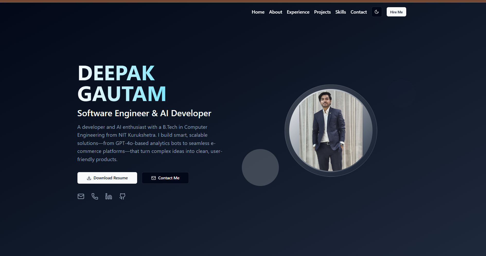

# Personal Portfolio - Deepak Gautam

Welcome to the source code for my personal portfolio. This project was built from the ground up to showcase my skills in full-stack development, data engineering, and Generative AI. It's a fully responsive, interactive single-page application designed to highlight my professional experience and key projects.

[](https://portfolio-react-nine-orpin.vercel.app/)
[](https://www.linkedin.com/in/deepak-a77b93222/)
[](https://github.com/Deepak-gautam1)

---

### Themes Showcase

The portfolio features a sleek, professional design with full support for both light and dark modes.

<table>
  <tr>
    <td align="center"><strong>Light Theme</strong></td>
    <td align="center"><strong>Dark Theme</strong></td>
  </tr>
  <tr>
    <td></td>
    <td></td>
  </tr>
</table>

- _**Note:** To make these screenshots appear, add your images named `lighttheme.png` and `darktheme.png` to a folder path like `public/images`._

## ✨ Core Features

- **Modern & Responsive Design:** Fully responsive layout built with Tailwind CSS for a seamless experience on all devices.
- **Interactive UI:** Built with `shadcn/ui` and includes smooth scroll animations, hover effects, and modal pop-ups for certificate viewing.
- **Dynamic Sections:** Features comprehensive sections for About Me, Experience, Projects, Skills, and Achievements.
- **Functional Contact Form:** Integrated with Supabase to capture and store messages directly from the site.
- **Light & Dark Mode:** A theme toggle allows users to switch between light, dark, and system-default themes.

## 🛠️ Tech Stack

This project was built using a modern and powerful set of technologies:

- **Frontend:** React, Vite, TypeScript
- **Styling:** Tailwind CSS
- **UI Components:** `shadcn/ui`
- **Animations:** Framer Motion, `tailwindcss-animate`
- **Backend (Contact Form):** Supabase
- **Icons:** Lucide React
- **Routing:** React Router DOM

## 🚀 Getting Started

To clone and run this project locally, you'll need [Node.js](https://nodejs.org/en/) (v18 or later) and [npm](https://www.npmjs.com/) installed on your computer.

1.  **Clone the repository:**

    ```sh
    git clone [https://github.com/Deepak-gautam1/Portfolio.git](https://github.com/Deepak-gautam1/Portfolio.git)
    ```

2.  **Navigate to the project directory:**

    ```sh
    cd Portfolio
    ```

3.  **Install the dependencies:**

    ```sh
    npm install
    ```

4.  **Run the development server:**
    ```sh
    npm run dev
    ```

The application will be available at `http://localhost:5173`.

## 🚢 Deployment

This Vite project is deployed on [Vercel](https://vercel.com/). The site is automatically updated upon every push to the `main` branch.

## 📜 License

This project is licensed under the MIT License.
