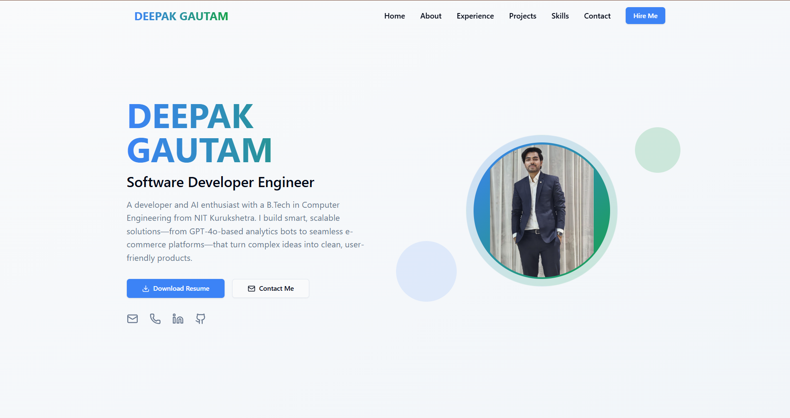
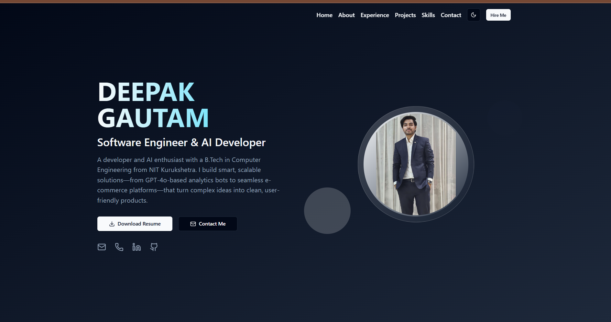

<div align="center">

# Deepak Gautam — Portfolio

**Data Engineer · Loyalty Systems · RAG Pipelines · AI Developer**

[](https://portfolio-react-nine-orpin.vercel.app/)
[](https://www.linkedin.com/in/deepak-a77b93222/)
[](https://github.com/Deepak-gautam1)
[](https://leetcode.com/u/Leevi_01/)
[](https://www.codechef.com/users/leevii)

</div>

---

## Theme Showcase

<table>
  <tr>
    <td align="center"><b>Light Mode</b></td>
    <td align="center"><b>Dark Mode</b></td>
  </tr>
  <tr>
    <td></td>
    <td></td>
  </tr>
</table>

---

## What Makes This Portfolio Stand Out

This isn't a template. Every component is custom-built with production-level attention to detail:

- **DG Intro Loader** — animated monogram that plays once per session, then skips on reload via `sessionStorage`
- **Lenis Smooth Scroll** — physics-based scrolling that makes the entire site feel like a premium product
- **Custom Cursor** — spring-animated dot + ring that follows the mouse, expands on hover, disabled on touch devices
- **Magnetic Buttons** — CTAs and social icons pull toward the cursor using Framer Motion springs
- **Animated Mesh Blobs** — softly morphing gradient orbs behind the hero section
- **Particle Network** — canvas-based floating particles with connection lines in the hero background
- **3D Tilt Cards** — project cards tilt with mouse tracking and show a radial cursor glow
- **Active Nav Highlight** — navigation underline slides between sections via IntersectionObserver + Framer Motion `layoutId`
- **Back-to-Top Button** — appears after 400px scroll with spring animation
- **Project Filter Tabs** — filter 9 projects by All / AI·ML / Full Stack / Data Engineering / Production with animated count badges
- **CP Rating Rings** — animated SVG stroke rings for LeetCode, CodeChef, Codeforces with real profile links
- **GitHub Heatmap** — live contribution grid fetched directly from GitHub API, no third-party image services
- **Scroll Progress Bar** — gradient top bar that fills as you scroll
- **Branded Tech Marquee** — two infinite-scroll rows with real SVG brand logos (React, TypeScript, Python, Azure, Docker, etc.)
- **Animated Counters** — stats count up with ease-out cubic when scrolled into view
- **Contact Success State** — animated green checkmark replaces form on send, backed by Supabase
- **Dark / Light Mode** — full theme system with smooth transitions
- **Accessible** — skip-to-content link, ARIA labels, keyboard navigation, focus rings
- **SEO Ready** — OG tags, Twitter cards, sitemap.xml, robots.txt, canonical URL, DG favicon

---

## Tech Stack

| Layer | Technologies |
|---|---|
| **Framework** | React 19 + TypeScript + Vite |
| **Styling** | Tailwind CSS + shadcn/ui |
| **Animations** | Framer Motion + Lenis |
| **Backend** | Supabase (contact form storage) |
| **Data** | GitHub REST API (live stats) |
| **Icons** | Lucide React + Simple Icons (SVG) |
| **Routing** | React Router DOM |
| **State** | React Query |
| **Deployment** | Vercel (auto-deploy on push) |

---

## Sections

| # | Section | Highlights |
|---|---|---|
| 1 | **Hero** | Typewriter titles · animated blobs · rotating glow ring · 4 stat cards |
| 2 | **About** | Animated info cards · education · current role · CP achievements |
| 3 | **Experience** | Americana Restaurants — Peet's Coffee Loyalty Platform · Sales Deep Analyzer RAG pipeline |
| 4 | **Tech Stack** | Infinite marquee · dual rows · SVG brand logos · hover brand-color glow |
| 5 | **Projects** | 9 projects · filter tabs · 3D tilt · featured ribbon · live demo + code links |
| 6 | **Skills** | Skill cards · CP rating rings · animated counters · certification viewer |
| 7 | **GitHub** | Live stats · language bars · top repos · contribution heatmap (873 contributions) |
| 8 | **Contact** | Supabase-backed form · animated success state · availability badge |

---

## Getting Started

```bash
# Clone
git clone https://github.com/Deepak-gautam1/PortfolioReact.git
cd PortfolioReact

# Install
npm install

# Dev server
npm run dev
# → http://localhost:5173
```

### Environment variables

Create a `.env` file in the root with your Supabase credentials (for the contact form):

```env
VITE_SUPABASE_URL=your_supabase_url
VITE_SUPABASE_ANON_KEY=your_supabase_anon_key
```

---

## Build & Deploy

```bash
# Production build
npm run build

# Preview build locally
npm run preview

# Deploy to Vercel (auto-deploys on every push to main)
vercel --prod
```

The `vite.config.cjs` uses `manualChunks` to split the bundle into vendor chunks (React, Framer Motion, Supabase, Lenis, Router) for optimal caching and load performance.

---

## Project Structure

```
src/
├── Components/
│   ├── Hero.tsx              # Typewriter + blobs + magnetic buttons
│   ├── Navigation.tsx        # Active section tracking + back-to-top
│   ├── IntroLoader.tsx       # DG monogram animation (session-aware)
│   ├── SmoothScroll.tsx      # Lenis physics scroll
│   ├── CustomCursor.tsx      # Spring-animated custom cursor
│   ├── ScrollProgress.tsx    # Gradient scroll progress bar
│   ├── ParticleBackground.tsx# Canvas particle network
│   ├── MagneticButton.tsx    # Cursor-following button wrapper
│   ├── TechMarquee.tsx       # Infinite scroll with SVG brand logos
│   ├── Experience.tsx        # Work history with project banners
│   ├── Projects.tsx          # Filter tabs + 3D tilt cards
│   ├── Skills.tsx            # Skill cards + certifications
│   ├── CPRatings.tsx         # Animated rating rings
│   ├── GitHubStats.tsx       # Live GitHub API integration
│   ├── Contact.tsx           # Supabase form + success state
│   ├── About.tsx             # Animated info cards
│   └── Footer.tsx            # 3-column footer with nav links
├── pages/
│   ├── Index.tsx             # Main page orchestrator
│   └── NotFound.tsx          # Branded 404 page
└── index.css                 # Tailwind + CSS variables (light/dark)
```

---

## Performance

- Bundle split into 6 vendor chunks for long-term browser caching
- `loading="lazy"` on all images
- `sessionStorage` prevents intro animation replaying on refresh
- Lenis RAF loop tied to requestAnimationFrame, not setInterval
- GitHub data fetched client-side — no server required

---

## License

MIT © [Deepak Gautam](https://github.com/Deepak-gautam1)
